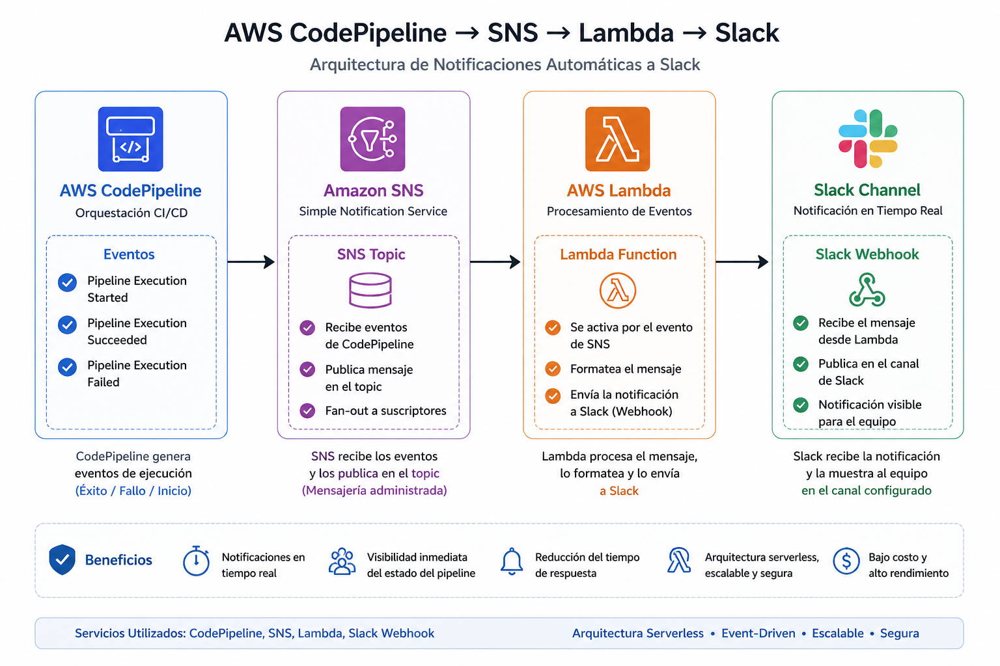

# 🔔 AWS CodePipeline → SNS → Lambda → Slack Notifications

## 📖 Descripción

Este proyecto demuestra cómo implementar notificaciones automáticas en Slack cuando ocurre un evento en AWS CodePipeline, utilizando una arquitectura orientada a eventos con:

- Amazon SNS
- AWS Lambda
- Slack Webhook
- AWS CodePipeline

Región utilizada: **us-west-2 (Oregon)**

---

## 🏗️ Arquitectura

<p align="center">
  
</p>

---

## 🎯 Objetivo

Enviar notificaciones automáticas a Slack cuando el pipeline:

- Inicia ejecución
- Finaliza correctamente
- Falla
- Es cancelado

---

## ⚙️ Implementación Paso a Paso

### 1️⃣ Crear SNS Topic

Servicio: Amazon SNS  
Tipo: Standard  
Nombre: `codepipeline-slack-topic`

---

### 2️⃣ Crear Lambda Function

Servicio: AWS Lambda  

Configuración:
- Runtime: Python 3.9
- Nombre: `codepipeline-slack-notifier`
- Rol IAM con permisos básicos

---

### 3️⃣ Configurar Variable de Entorno

En Lambda → Configuration → Environment variables:


---

### 4️⃣ Agregar Trigger SNS a Lambda

Lambda → Configuration → Triggers → Add trigger

Source: SNS  
Topic: `codepipeline-slack-topic`

---

### 5️⃣ Crear Notification Rule en CodePipeline

CodePipeline → Pipeline → Notify → Create notification rule

Eventos recomendados:
- Pipeline execution started
- Pipeline execution succeeded
- Pipeline execution failed
- Pipeline execution cancelled

Target:
- SNS Topic

---

## 🧠 Código Lambda

```python
import json
import os
import urllib3

http = urllib3.PoolManager()
WEBHOOK_URL_SLACK = os.environ["SLACK_WEBHOOK_URL"]

def lambda_handler(event, context):
    message = json.loads(event["Records"][0]["Sns"]["Message"])
    
    detail = message.get("detail", {})
    state = detail.get("state", "UNKNOWN")
    pipeline = detail.get("pipeline", "N/A")
    region = message.get("region", "us-west-2")

    emojis = {
        "STARTED": "🔄",
        "SUCCEEDED": "✅",
        "FAILED": "❌",
        "CANCELED": "⏹️"
    }

    if state not in emojis:
        return

    pipeline_url = f"https://{region}.console.aws.amazon.com/codesuite/codepipeline/pipelines/{pipeline}/view?region={region}"

    slack_message = {
        "text": f"{emojis[state]} *Pipeline {state}*\n"
                f"• Pipeline: `{pipeline}`\n"
                f"• <{pipeline_url}|Ver en AWS Console>"
    }

    http.request(
        "POST",
        WEBHOOK_URL_SLACK,
        body=json.dumps(slack_message).encode("utf-8"),
        headers={"Content-Type": "application/json"}
    )

    return {"statusCode": 200}

